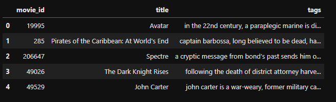
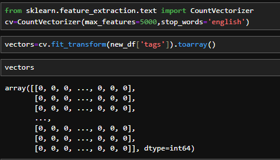

# Movie Recommender System

## Introduction :
In this project we are making a movie recommender system using *'Content based Filtering'*

### Types Of Recommender System:-

  #### 1. Collaborative Filtering :

  Recommends items to you based on ratings of users who gave similar ratings as you. 
  Means it finds similarity between users or items and according to that it recommends things.

  #### 2. Content based filtering:

  Recommends items based on features of user and item  to find good match. Unlike collaborative filtering, it doesn't rely on other users' behaviors.
  There are different approaches for implementing this Content based filtering :
  
  - Direct Similarity Computation :
    It dierctly computes similarity(like cosine) between features. No training is required. Works well when features are well-engineered. In this project we are using this approach.
    
  - Concatenation with neural Network Approach :
    It concatenates user and item feature vectors. Then passed through neural layers and outputs a single prediction score.
    
  - Two tower Architecture :
    Separate neural networks for user and item features. Each tower learns its own represnetations. Then it compute similarity between final embeddings.
    
  - Hybrid Approach :
    Combines similarity based and neural network paths.
    
  - Neural Similarity Network:
    Projects user and item features into same embedding space. And then computes similarity in this learned space.
       
       
## Installation

Clone the repository:

```bash
git clone https://github.com/spkid-ui/Movie-Recommender-System.git
```

Move into the project:

```bash
cd Movie-Recommender-System
```

Install dependencies:

```bash
pip install -r requirements.txt
```

Open the notebook:

```bash
jupyter notebook
```


## Step by Step Guide :
 ### 1. Dataset:- 
 Link : https://www.kaggle.com/datasets/tmdb/tmdb-movie-metadata?resource=download
 
 Here we are loading both *'tmdb_5000_movies.csv'* and *'tmdb_5000_credits.csv'*

 ### 2. Data Preprocessing :
 - We merge both movies and credits on the basis of *title*.
 - We'll keep only few columns that are necessary like *'movie_id','title','overview','genres','keywords','cast','crew'*
 - The data in the columns is not the proper list format. So we have to convert that into proper list forms.
 - After applying all transformation to convert data into proper format, we then combine *'overview','genres','keywords','cast','crew'* into one single column *'tags'*
 - So, our final data looks like this :-
   


 - We have to apply stemming operation in the 'tags' column means we have to get the *root* word from the whole word like *run* from *running*.
 - Now , we have to convert our text data into some vector form. So we import *'CountVectorizer'*here as it converts text data into some numberical value.
 -  The max_features parameter specifies the maximum number of features (unique words) to consider in the vocabulary. Setting it to 5000 means that only the 5000 most frequent words will be used.
 -  The stop_words parameter specifies a list of words to be ignored during the vectorization process. Setting it to 'english' indicates that the built-in list of English stop words (common words like "the", "and", "in") will be used.

    

### 3. Cosine Similarity:
It actually measures the cosine of the angle between two vectors. Cosine similarity is a metric, helpful in determining, how similar the data objects are irrespective of their size.

Sc(x,y) = x . y / ||x|| × ||y||

The cosine similarity between two vectors is measured in ‘θ’.

### 4. Results:


